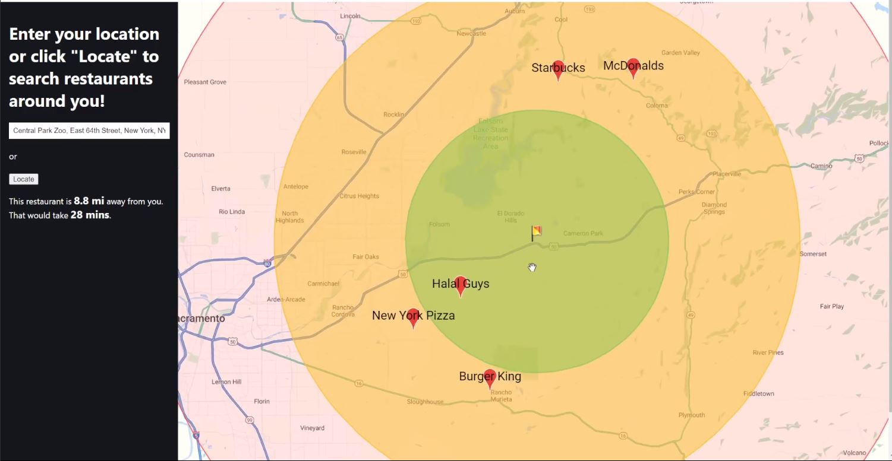

# Restaurant Finder

Restaurant Finder is a single-page web application that can get the real-time user location on Google Maps and send personalized notifications about the local business around them.

---

[Video Demo](https://youtu.be/KzjTX-5gegk)

## Tech Stack

* Language: [TypeScript](https://www.typescriptlang.org/)
* React Framework: [Next.js](https://nextjs.org/)
* Google Maps APIs: [Google Maps Platform](https://cloud.google.com/)
* Notification Feature: [React-Toastify](https://github.com/fkhadra/react-toastify)
* Linter: [ESlint](https://eslint.org/)

